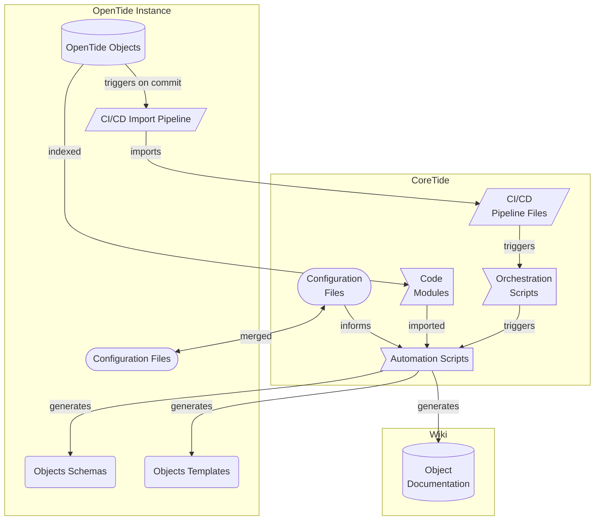

<table align="center"><tr><td align="center" width="9999">

# InitTide

_The Entry Point to Detection Ops_

</td></tr></table>

### Overview

This repository is your starting point to use OpenTide : it is a template repository, with the basic folder structure to get you going, basic configuration files, and the basic necessary CI/CD files to support pipelines.

## Getting Started

### Configuration Files
Configuration files, written in TOML, control many aspect of the system, from defining API Keys for your rules deployments, to tuning how documentation is generated, or where files are located. By default, we only ship in this repo the most relevant configuration files.

#### Advanced Utilisation
you may copy in your repo any of the config file described in [CoreTide/Configurations](https://github.com/OpenTideHQ/CoreTide/tree/development/Configurations), and override any setting - the pipelines will always perform at startup a reconciliation, where your instance config take precedence over the base configs provided by CoreTide.

#### About Secrets
> Only for specific sections of configuration files under Configurations/systems !

For system deployment configurations, defining API Tokens and other secrets in a configuration file isn't safe. The framework supports a way to retrieve secrets from the environment variables, by prefixing the variable name with `$`. You then only need to create those variables on your CI/CD system (Gitlab CI Variable, Azure DevOps Variable Groups etc.).

##### WIP
Splunk, Sentinel and Carbon Black Cloud will migrate to the MDRv4 deployment framework, and only the `[tenant.setup]` section will be relevant in the future. For now, refer to the configuration file for your chosen platform - it will contain all the required information to understand where secrets must be placed, and in which format.

##### Azure DevOps
IMPORTANT - In Azure Pipelines, if you declare a CI Variable as a secret, it will prevent it from being directly read by the CoreTide scripts as environment variables . To work around this limitation, you can use `.azure/set_secrets.yml`, which will allow you to declare your variables again and broadcast them to the pipeline. The secrets will still not be printed to the console, even if they will exist in the environment variable context.

##### Github Actions
Similarly to Github Actions, you need to declare your secrets in `.github/workflows/main.yml` under the Secrets job, by passing them as environment variables. Environment variables are frozen, stringified, encoded to hex and then injected to imported workflows from CoreTide, and finally made available Even Secrets can't be printed to the console and don't exit the runner environment. 

### Setting up CI/CD

CoreTide currently supports the following CI/CD systems out of the box : 

- Azure Pipelines
- Gitlab CI
- Github Actions

We welcome any participation and feedback regarding the CI/CD systems that are most useful to the community. If your VCS is supported, you need to provision a runner for the project and ensure it's able to reach to the your target systems API endpoints (if you wish to use Detection-as-Code). Refer to the relevant CI/CD file in InitTide to see what to configure.

#### Consuming CoreTide

##### Architecture
OpenTide philosophy is that the code backend (hosted on [CoreTide/Configurations](https://github.com/OpenTideHQ/CoreTide/tree/development/Configurations) )and content should be strictly separated, to reduce the amount of complexity to maintain many parralel content branches, which would make rebasing a constant chore to backport fixes. For simplicity purposes, an OpenTide instance is essentially a "thin-client", which holds object definitions (YAML Files) and Configurations as input - and receive updated Schema and Templates. All code in a pipeline is ephemeral - CoreTide is temporally cloned and nested into the working directory, where it will resolve file paths to retrieve the OpenTide Objects, and export Schema/Templates if needed.

In the end, this makes your experience of OpenTide much easier, and touchless, while you retain control of how you consume the CoreTide Repository.

##### Remote (Recommended)
As long as your Version Control System is supported, and is able to reach the CoreTide repo hosted @ [github.com/opentidehq/coretide](), you don't need to do anything : when a CI/CD pipeline is triggered, the base CI/CD files in InitTide will start calling remote CI/CD files hosted on CoreTide to build a full pipeline. This architecture allows you to not have to maintain any infrastructure - your repo, once setup, will benefit from all the new features and bugfixes on each new pipeline run. 

You may choose to consume from the latest release by pointing your dependency to the continuously updated `development` branch, or if you desire for stability, to any more stable branch (such as `release/X.X`). Refer to the relevant CI file for the configuration. 

##### Local (For development)
If you need to maintain your own version of CoreTide, usually for developing new features or for air-gapping purposes, you may completely clone CoreTide on your own systems. You then need to edit the CI files to point it to the new repository. We recommend to update your clone time to time (or use a mirrorring setup), so you may still benefit from new releases. 

### Updating InitTide
You shouldn't need to update InitTide once setup - however we still recommend checking from time to time, as we may bring quality of life improvement and fixes, especially to base CI/CD file which we may update following community feedback.

